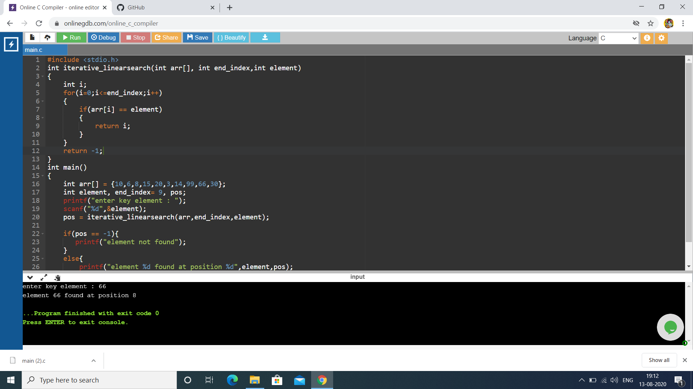
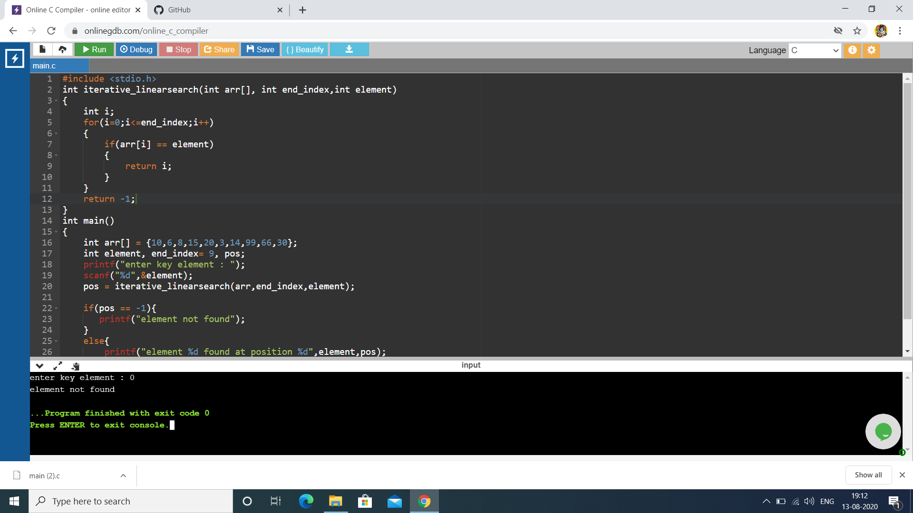

# Aim :
To write a program using non-recursive function to perform Linear search operations for a Key value in a given list of integers.
# Description :
Linear search in C to find whether a number is present in an array. If it's present, then at what location it occurs. It is also known as a sequential search.
It is straightforward and works as follows:
1. Start from the leftmost element of arr[] and one by one compare x with each element of arr[]
2. If x matches with an element, return the index of that element.
3. If x doesn’t match with any of elements, then it return -1.

The time required to search an element using the algorithm depends on the size of the list. In the best case, it's present at the beginning of the list, in the worst-case, element is present at the end. Its time complexity is O(n).
# Step-by-step procedure :
1. List of integers : arr[] = {10,6,8,15,20,3,14,99,66,30}.                                                                       
End_Index = 9
## Case-1 : Key element = 66.                                                                                                     
2. In this program the Key element is compared with each element. When the Keyelement = element ig array it returns the position of that element in th array.                                                                                                         
Iteration-1: arr[0] = 10;                                                                                                                      keyelement != arr[0]                                                                                                    It moves to next iteration                                                                                                         
Iteration-2: arr[1] = 6                                                                                                                       keyelement != arr[1]                                                                                                      Simillarly it moves to next iterations                                                                                    .                                                                                                                                
. 
...                                                                                                                            
Iteration-8 : arr[7] = 99                                                                                                                       Keyelement != arr[7]                                                                                                    It moves to next iteration                                                                                                         
Iteration-9 : arr[8] = 66                                                                                                                      Keyelement == arr[8]                                                                                                    
In Iteration-9 the condition satisfies. And the element's index is 8                                                     
Position is the index of given element.                                                                                          
### The program's output is : element 66 found at position 8                                          

                                                                                                                                                                                                                                                                  
## Case-2 : Key element : 0                                                                           
3. In this program the Key element is compared with each element. When the Keyelement = element ig array it returns the position of that element in th array.                                             
Iteration-1: arr[0] = 10;                                                                                                                      keyelement != arr[0]                                                                                                    It moves to next iteration                                                                                                         
Iteration-2: arr[1] = 6                                                                                                                       keyelement != arr[1]                                                                                                      Simillarly it moves to next iterations                                                                                    .                                                                                                                                
. 
...                                                                                                                            
Iteration-8 : arr[7] = 99                                                                                                                       Keyelement != arr[7]                                                                                                    It moves to next iteration                                                                                                         
Iteration-9 : arr[8] = 66                                                                                                                      Keyelement != arr[8]                                                                                            
Iteration-10 : arr[9] = 30                                                                                                                      Keyelement != arr[9]                                                                                                                                                                                                                             
Here the Keyelement is comparied with each element of the given arry. But the given Keyelement is not equal to any of the element in the given array.                                                       
### The program's output for given case-2 is : element not found.                                     

