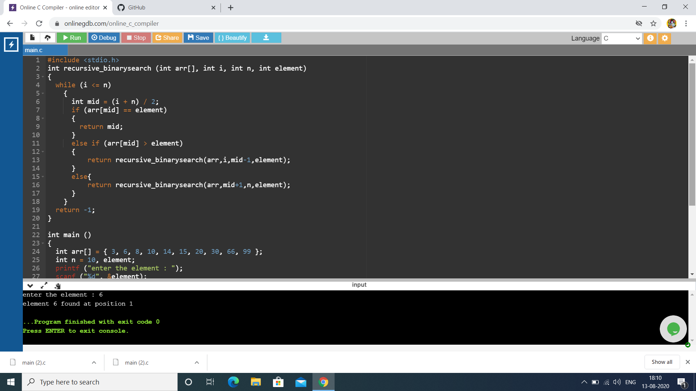
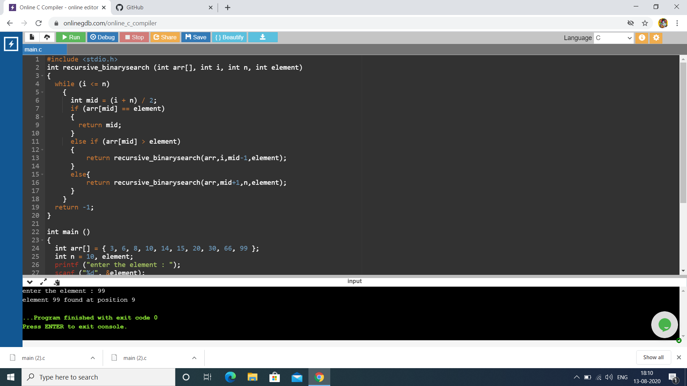

# Aim :                                                                                      
To write a program using recursive function to perform Binary search operations for a Key element in the given list of integers. 
# Description :
Binary Search: Search a sorted array by repeatedly dividing the search interval in half.                 
Binary Search is applied on the sorted array or list of large size. It's time complexity of O(log n) makes it very fast as compared to other sorting algorithms.                                             
The only limitation is that the array or list of elements must be sorted for the binary search algorithm to work on it.                                                                                           
It works as follows :                                                                                   
1. Compare x with the middle element.
2. If x matches with middle element, we return the mid index.
3. Else If x is greater than the mid element, then x can only lie in right half subarray after the mid element. So we recur for right half.
4. Else (x is smaller) recur for the left half.                                                         
Where x is the Key value. We basically ignore half of the elements just after one comparison.           
# Step-by-step procedure : 
1. List of integers : arr[] = {3, 6, 8, 10, 14, 15, 20, 30, 66, 99}                                     
## Case-1 : Keyelement = 6
Initially , start index(i)=0, end index(n) = 9                                                       
    middle index(mid) = (i+n)/2 = 4                                                                   
### Iteration-1 : 
arr[4] = 14                                                                                           
element < arr[4]                                                                                     
It return to recur for the left half , by changing end index(n) to mid - 1 
### Iteration-2 :
start index = 0, end index = mid - 1 = 3                                                             
mid = (0 + 3)/2 = 2                                                                                   
arr[2] = 8                                                                                           
element < arr[2]
### Iteration-3 :
n = 3 - 1 = 2, i=0                                                                                   
mid = 1                                                                                               
arr[1] = 6                                                                                           
element = arr[1]                                                                                   
Here the condition satisfies and returns final mid value i.e 1                                     
### Output of following case is : element 6 found at 1 position                                      

## Case-2 : keyelement = 14                                                                           
Initially,                                                                                           
### Iteration-1:                                                                                   
  start index(i) =0 , end index(n) = 9 ,                                                     
  middle index(mid) = (i + n) / 2 = 4                                                                
  arr[4] = 14                                                                                         
  element == arr[4]                                                                                  
  Here the condition satisfies and return the position as mid value                                   
  ### Output of following case : element 14 found at 4 position 
  
## Case-3 : keyelement = 99     
Initially , start index(i)=0, end index(n) = 9                                                       
    middle index(mid) = (i+n)/2 = 4                                                                   
### Iteration-1 : 
arr[4] = 14                                                                                           
element >arr[4]                                                                                     
It return to recur for the right half , by changing start index(i) to mid + 1 
### Iteration-2 :
start index = 5, end index = 9                                                             
mid = (5 + 9)/2 = 7                                                                                   
arr[7] = 30                                                                                           
element > arr[7]
### Iteration-3 :
i = 7 + 1 = 8, n = 9                                                                                 
mid = 8                                                                                               
arr[8] = 66                                                                                           
element > arr[8]                                                             
### Iteration-4 :
i = 8+1 = 9 ,n = 9                                                                                   
mid = 9                                                                                               
arr[9] = 99                                                                                         
element = arr[9]                                                                                   
Here the condition satisfies and return position as mid value                                       
### Output of following case : element 99 found at 9 position

