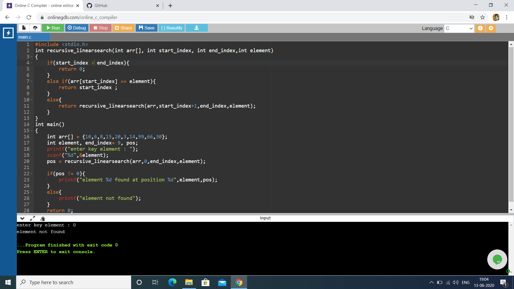

# Aim :
To write a program using recursive function to perform Linear search operations for a Key value in a given list of integers.
# Description :
Linear search in C to find whether a number is present in an array. If it's present, then at what location it occurs. It is also known as a sequential search.                                     
It is straightforward and works as follows:                                                        x is a key element                                                                               
1. Start from the leftmost element of arr[] and one by one compare x with each element of arr[]
2. If x matches with an element, return the index of that element.
3. If x doesn’t match with any of elements, then it return -1.                                   
The idea is to compare x with first element in arr[]. If element is found at first position, return it. Else recur for remaining array and x.                                                  
The time required to search an element using the algorithm depends on the size of the list. In the best case, it's present at the beginning of the list, in the worst-case, element is present at the end. Its time complexity is O(n).
# Step-by-step procedure :
1. List of integers : arr[] = {10,6,8,15,20,3,14,99,66,30}                                                End index = 9                                                                                       
## Case-1 : Keyelement = 66                                                                           
2. In this program starting index must be greater than end index                                  
3. Initially                                                                                         
start index = 0                                                                                     
arr[0] =10                                                                                         
keyelement != arr[10]                                                                               
Here the condition not satisfied ,so it recur for reamining array by considering start index = 0+1                                                                                                    
start index = 1 ,                                                                                     
arr[1] = 6                                                                                          
keyelement != arr[1]                                                                               
simillarly start index = 1+1 = 2                                                                     
arr[2] = 8                                                                                           
keyelement != arr[2]                                                                                 
simillarly it increases the start index to 3...4...5...6...7...                                       
...                                                                                                   
then start index = 7+1 = 8                                                                           
arr[8] = 66                                                                                           
keyelement == arr[8]                                                                                 
Finally the condition satisfies.And position is the final start index in the program ,which is 8.     
### Output of following case is : element 66 found at position 8.                                     

## Case-2 : Keyelement = 0                                                                           
4. In this program starting index must be greater or equal to than end index                         
5. Initially                                                                                           
start index = 0                                                                                     
arr[0] =10                                                                                         
keyelement != arr[10]                                                                               
Here the condition not satisfied ,so it recur for reamining array by considering start index = 0+1     
start index = 1 ,                                                                                     
arr[1] = 6                                                                                          
keyelement != arr[1]                                                                               
simillarly start index = 1+1 = 2                                                                     
arr[2] = 8                                                                                           
keyelement != arr[2]                                                                                 
simillarly it increases the start index to 3...4...5...6...7...                                       
...                                                                                                   
then start index = 7+1 = 8                                                                           
arr[8] = 66                                                                                           
keyelement != arr[8]                                                                                 
Then start index = 8+1 =9                                                                             
arr[9] = 30                                                                                           
keyelement != arr[9]                                                                                 
start index = 9 + 1 = 10                                                                             
Here start index > end index .Then it comes out of the function which indicates that the given key element is not present in the given array.                                                           
this is the worst-case with time complexity O(n)                                                     
### Output of following case is : element not found.                                                   

