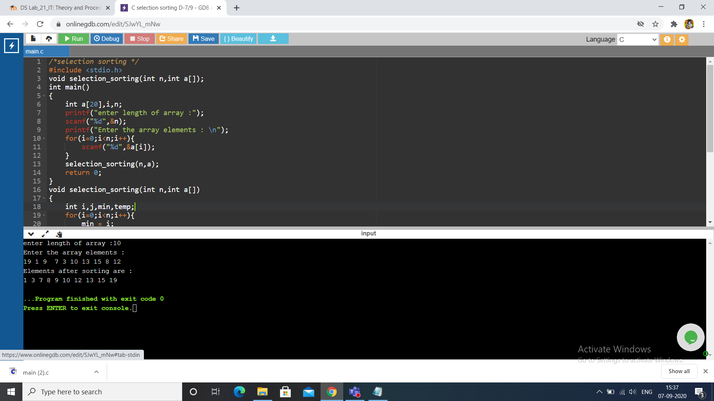
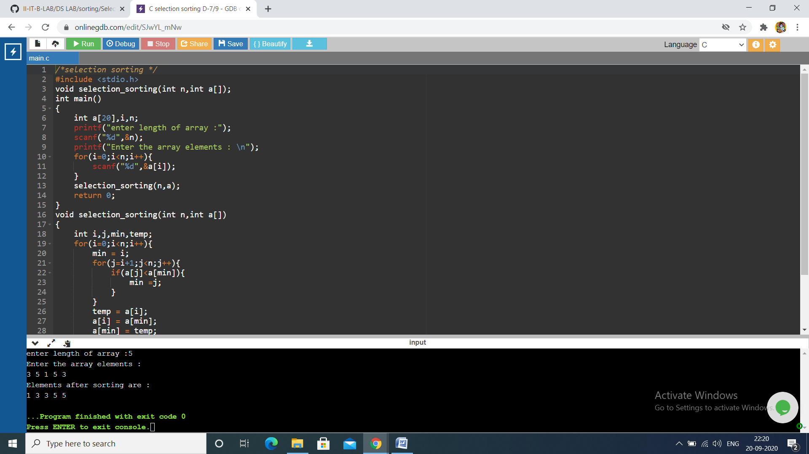

# Aim :
To write a program to perform selection sort operation for the given list of integers
# Description:
The selection sort algorithm sorts an array by repeatedly finding the minimum element (considering ascending order) from unsorted part and putting it at the beginning.                                       
The algorithm maintains two subarrays in a given array.

1) The subarray which is already sorted.
2) Remaining subarray which is unsorted.
Time Complexity: O(n2) as there are two nested loops
# Step-by-Step Procedure : 
### Case-1 :
Array = [19,1,9,7,3,10,13,15,8,12].                                                                     
First the minimum value is considered as array[0] = 19 , we search the whole list and find that 1 is the lowest value.                                                                                       
So we replace 19 with 1. After one iteration 1, which happens to be the minimum value in the list, appears in the first position of the sorted list.                                                       
Array =[1,19,9,7,3,10,13,15,8,12].                                                                     
Then we consider 2nd position i.e 19 ,and we find that 3 is 2nd lowest value so we swap these values.   
Array = [1,3,9,7,19,10,13,15,8,12].                                                                     
Then we consider 3rd position i.e 9 ,and we find that 7 is 3rd lowest value so we swap these values.   
Array = [1,3,7,9,19,10,13,15,8,12].                                                                     
Then we consider 4rt position i.e 9 ,and we find that 8 is 4rt lowest value so we swap these values.   
Array = [1,3,7,8,19,10,13,15,9,12].                                                                     
Then we consider 5th position i.e 19 ,and we find that 9 is 5th lowest value so we swap these values.   
Array = [1,3,7,8,9,10,13,15,19,12].                                                                     
Then we consider 6th position i.e 10 ,and we find that 10 is 6th lowest value so no swap takes place.   
Array = [1,3,7,8,9,10,13,15,19,12].                                                                     
Then we consider 7th position i.e 13 ,and we find that 12 is 7th lowest value so we swap these values. 
Array = [1,3,7,8,9,10,12,15,19,13].                                                                     
Then we consider 8th position i.e 15 ,and we find that 13 is 8th lowest value so we swap these values. 
Array = [1,3,7,8,9,10,12,13,19,15].                                                                     
Then we consider 9th position i.e 19 ,and we find that 15 is 9th lowest value so we swap these values. 
Array = [1,3,7,8,9,10,12,13,15,19].                                                                     
Now the given array is sorted array ,so it comes out of loop
#### Output of following case is [1,3,7,8,9,10,12,13,15,19]

### Case-2:
Array = [3,5,1,5,3]                                                                                     
Firstly min = 3, we search the whole array and finds 1 as lowest value.                                 
so we replace 3 with 1 .After one iteration 1, which happens to be the minimum value in the list, appears in the first position of the sorted list.                                                       
Array =[1,5,3,5,3].                                                                     
Then we consider 2nd position i.e 5 ,and we find that 3 is 2nd lowest value so we swap these values.   
Array = [1,3,5,5,3].                                                                                   
Then we consider 3rd position i.e 5 ,and we find that 3 is 3ed lowest value so we swap these values.   
Array = [1,3,3,5,5].                                                                                   
Then we consider 4rt position i.e 5 ,and we find that 5 is 4rt lowest value so no swaping takes place. 
Array = [1,3,3,5,5].                                                                                   
Then we consider 5th position i.e 5 ,and we find that 5 is 5th lowest value so no swaping takes place. 
Array = [1,3,3,5,5].
Now the given array is sorted array, so it comes out of loop 
#### Output of following case is [1,3,3,5,5]

